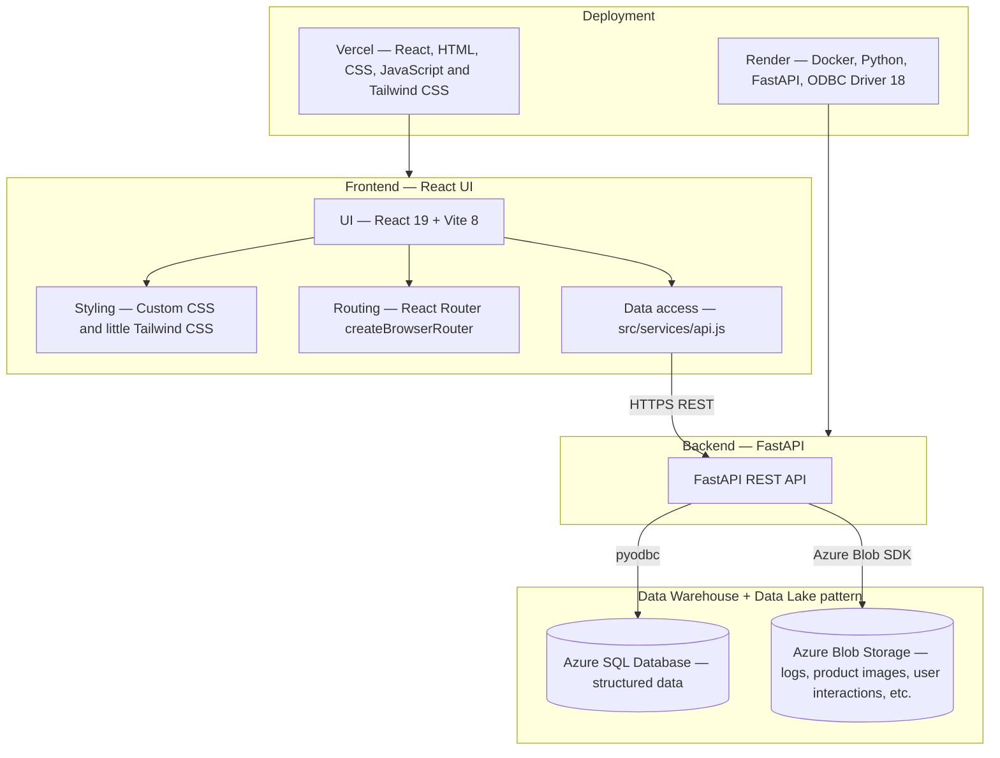

# The Crystal Shroom - a Feng Shui eCommerce Shop

## Introduction

At The Crystal Shroom, we believe that every stone holds a unique story and a distinct energy. Born from a deep passion for nature's hidden treasures, our shop offers a hand-selected range of authentic feng shui crystals designed to elevate your space and spirit. Whether you are seeking tranquility, prosperity, or simply a beautiful piece of the earth, The Crystal Shroom is here to guide you on your journey to inner harmony.

## Project Title

An eCommerce Website for a jewelry shop that allows:

- Client side: Look and add product(s) to the shopping cart; proceed to the payment page; track for the shipping status, etc.
- Admin side: Manage all the products in the Admin Portal, including Add/Update/Delete products, etc.

## Techstack

- **Frontend:** React 19, Vite 8; HTML, CSS, JavaScript (general design), and Tailwind CSS (advanced design).
- **Styling:** Custom CSS in `src/styles/` and `src/index.css` (layout, home, header/footer, admin forms, modals, etc.).
- **Routing:** React Router with `createBrowserRouter` — public home and login; nested admin routes under `/admin/products` (list, add, update by `productId`).
- **Backend:** Python, FastAPI.
- **Database:** Azure SQL Database (Data Warehouse) and Azure Blob Storage (Data Lake).
- **Deployment:** Backend ships with a **Dockerfile** (Python 3.12, ODBC Driver 18 for SQL Server, Uvicorn), deployed with **Render**. Frontend is deployed with **Vercel**.

## Design

### Architecture



### Database


## Features

- Responsive layout UI (not much).
- Paginated product grid on the Homepage with loading and error states.
- Admin authentication.
- Admin product list with **debounced search**, pagination, and detail view.
- **Create / update / delete** products with multi-image upload, validation, and confirmation modals; optional navigation guard when leaving with unsaved changes. A preview card shown in Add Product and Update Product pages.
- Categories and promotions loaded from the API; product cards show category labels.

## Project structure

```text
.
├── backend/
│   ├── .env
│   ├── blob_storage.py
│   ├── database.py
│   ├── Dockerfile
│   ├── main.py
│   ├── models.py
│   └── requirements.txt
├── src/
│   ├── assets/
│   ├── components/        # Reusable UI (layout, catalog, admin, modals)
│   ├── context/           # Auth and shared client state
│   ├── pages/             # Route-level pages (home, login, admin CRUD)
│   ├── services/          # API helpers (fetch, credentials)
│   ├── styles/            # CSS files
│   ├── App.jsx
│   ├── index.css
│   └── main.jsx
├── database.sql           # Schema design
├── eslint.config.js
├── index.html
├── package.json
├── vite.config.js
└── README.md
```

## Challenges
- Authentication: Struggling with implementing a secure, cookie-based authentication system across a decoupled frontend and API presented significant CORS and security challenges. As this is currently unresolved, I temporarily use a fixed credentials for the admin login, the full authentication logic will be in future updates.
- Cloud integration: I want to utilize the capabilities of Azure for online testing. However, transitioning from local file storage to Azure Blob Storage required handling multipart uploads and managing time-limited SAS URLs to ensure secure and scalable image delivery. This is needed for future features' extension and scaling up app (if needed).
- Backend deployment: Configuring the backend Docker image to connect to SQL Server via pyodbc required specific workarounds. Even though it seems to be easy at first, but I did suffer from some unexpected errors from the Render VM side.
- CRUD logic for Admin: Designing large administrative forms demanded a clear UX flow to handle live previews, duplicate-name validations, and multi-step confirmations without bottlenecking the main CRUD APIs.
- Some UI components are difficult to design just by using CSS, that is why Tailwind CSS came to place as a solution.
- Session/Cookies/Cache are still something I need to figure out to work on it. Also, I need to take care of SQL injection as well.

## Demo

**Website:** [The Crystal Shroom](https://feng-shui-shop-react.vercel.app/)
Please be aware that the API might be down frequently (due to Free plan deployment), preventing the website from loading data from the Data Warehouse.
