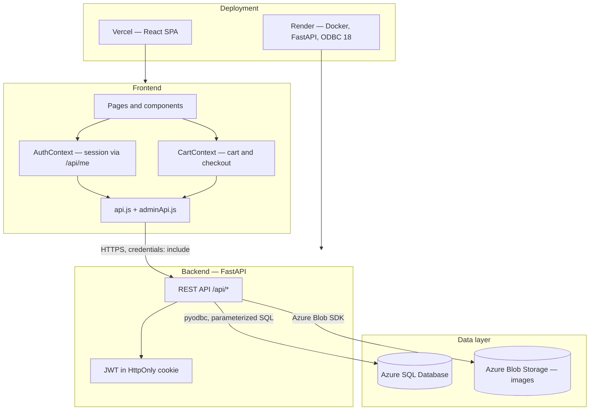

# The Elemental Sanctuary — Feng Shui eCommerce Shop

## Introduction

At **The Elemental Sanctuary**, we believe that every stone holds a unique story and a distinct energy. Born from a deep passion for nature's hidden treasures, our shop offers a hand-selected range of authentic feng shui crystals designed to elevate your space and spirit. Whether you are seeking tranquility, prosperity, or simply a beautiful piece of the earth, we are here to guide you on your journey to inner harmony.

## Project overview

A full-stack eCommerce application for a feng shui crystal shop:

- **Client:** Browse products, view details, register and sign in, manage a server-backed cart, and complete checkout with delivery and payment options.
- **Admin:** Dashboard, orders, products, promotions, categories, customers, and customer feedback — with role-protected routes and cookie-based API authentication.

## Tech stack

| Layer          | Technologies                                                                                                                                            |
| -------------- | ------------------------------------------------------------------------------------------------------------------------------------------------------- |
| **Frontend**   | React 19, Vite 8, React Router 7                                                                                                                        |
| **Styling**    | Tailwind CSS (CDN in `index.html` with custom design tokens), global utilities in `src/index.css`, Google Fonts (Noto Serif, Manrope), Material Symbols |
| **State**      | React Context — `AuthContext`, `CartContext`                                                                                                            |
| **API client** | `src/services/api.js` (public + shared), `src/services/adminApi.js` (admin endpoints)                                                                   |
| **Backend**    | Python 3.12, FastAPI, Uvicorn, PyJWT, bcrypt, pyodbc, Azure Blob SDK                                                                                    |
| **Database**   | Azure SQL Database (structured transactional data)                                                                                                      |
| **Storage**    | Azure Blob Storage (product images; soft-delete via recycle bin prefix)                                                                                 |
| **Deployment** | Frontend on **Vercel**; backend via **Docker** on **Render** (ODBC Driver 18 for SQL Server)                                                            |

## Design

### Architecture


```mermaid
flowchart TB
  subgraph deployment["Deployment"]
    Vercel[Vercel — React SPA]
    RenderStack[Render — Docker, FastAPI, ODBC 18]
  end

  subgraph frontend["Frontend"]
    UI[Pages and components]
    AuthCtx[AuthContext — session via /api/me]
    CartCtx[CartContext — cart and checkout]
    ApiClient[api.js + adminApi.js]
    UI --> AuthCtx
    UI --> CartCtx
    AuthCtx --> ApiClient
    CartCtx --> ApiClient
  end

  subgraph backend["Backend — FastAPI"]
    API[REST API /api/*]
    Auth[JWT in HttpOnly cookie]
    API --> Auth
  end

  subgraph datalayer["Data layer"]
    AzureSQL[(Azure SQL Database)]
    AzureBlob[(Azure Blob Storage — images)]
  end

  Vercel --> frontend
  RenderStack --> backend
  ApiClient -->|HTTPS, credentials: include| API
  API -->|pyodbc, parameterized SQL| AzureSQL
  API -->|Azure Blob SDK| AzureBlob
```

## Features

### Storefront

- Homepage with hero, philosophy section, and **paginated product grid** (loading and error states).
- **Product detail** page: image gallery, category and promotion badges, stock awareness, quantity selector, add-to-cart (requires customer sign-in).
- **Customer registration** and **login** with validation; session restored on reload via `/api/me`.
- **Shopping cart** synced with the API: add/update/remove lines, subtotal, shipping, tax, stock-issue flags.
- **Checkout** on `/cart`: payment method selection, delivery address (prefilled from profile), delivery date, order confirmation modal.
- Header cart badge and role-aware navigation (customers vs admin).

### Admin portal (`/admin/*`)

| Area           | Capabilities                                                                                                                                                                                                                    |
| -------------- | ------------------------------------------------------------------------------------------------------------------------------------------------------------------------------------------------------------------------------- |
| **Dashboard**  | KPIs, recent orders, top products, recent feedback                                                                                                                                                                              |
| **Orders**     | Debounced search, payment-status and date filters, pagination, order detail, toggle paid status                                                                                                                                 |
| **Products**   | List with debounced search, category and low-stock filters, sort options, inline detail preview; **create / update / delete** with multi-image upload, validation, confirmation modals, unsaved-change guard, live preview card |
| **Promotions** | List, create, edit, delete                                                                                                                                                                                                      |
| **Categories** | Product counts per category; edit descriptions                                                                                                                                                                                  |
| **Customers**  | Searchable list, customer detail with order history                                                                                                                                                                             |
| **Feedback**   | Filter by topic, paginated cards (visitor vs customer)                                                                                                                                                                          |

Shared admin UX: sidebar navigation, logout, route guard (`AdminLayout`).

## Routing

| Path                                                                           | Description                        |
| ------------------------------------------------------------------------------ | ---------------------------------- |
| `/`                                                                            | Home                               |
| `/login`, `/register`                                                          | Authentication                     |
| `/products/:productId`                                                         | Product detail                     |
| `/cart`                                                                        | Cart and checkout (customers only) |
| `/admin`                                                                       | Admin home (defaults to customers) |
| `/admin/dashboard`                                                             | Dashboard                          |
| `/admin/orders`, `/admin/orders/:orderId`                                      | Orders                             |
| `/admin/products`, `/admin/products/add`, `/admin/products/update/:productId`  | Products                           |
| `/admin/promotions`, `/admin/promotions/new`, `/admin/promotions/:promotionId` | Promotions                         |
| `/admin/categories`                                                            | Categories                         |
| `/admin/customers`, `/admin/customers/:customerId`                             | Customers                          |
| `/admin/feedback`                                                              | Feedback                           |

## Project structure

```text
.
├── backend/
│   ├── .env.example
│   ├── blob_storage.py      # Azure Blob upload, SAS URLs, recycle bin
│   ├── database.py          # pyodbc connection
│   ├── Dockerfile
│   ├── main.py              # FastAPI routes
│   ├── models.py            # Pydantic models
│   └── requirements.txt
├── src/
│   ├── assets/
│   ├── components/
│   │   └── admin/           # AdminSidebar, etc.
│   ├── context/             # AuthContext.jsx, CartContext.jsx
│   ├── pages/
│   │   └── admin/           # Dashboard, orders, promotions, …
│   ├── services/
│   │   ├── api.js
│   │   └── adminApi.js
│   ├── App.jsx
│   ├── index.css
│   └── main.jsx
├── index.html               # Tailwind CDN + theme config
├── eslint.config.js
├── package.json
├── vite.config.js
└── README.md
```

## Challenges

- **Cross-origin sessions:** Wiring **cookie-based JWT auth** between a Vercel frontend and a Render API required careful CORS (`allow_credentials`), `credentials: "include"` on fetches, and production cookie flags (`Secure`, `SameSite=None`). Customer auth is fully database-backed; **admin login still relies on env-configured credentials** rather than rows in `Accounts` — a deliberate simplification for the admin role.
- **Azure Blob integration:** Moving product images from local files to Blob Storage meant handling **multipart uploads**, consistent blob naming, recycle-bin moves on delete, and **time-limited SAS URLs** for secure delivery in the catalog and admin previews.
- **Backend deployment on Render:** The Docker image must install **ODBC Driver 18** and compatible system libraries so **pyodbc** can reach Azure SQL; platform-specific build and runtime issues were non-trivial despite a straightforward Dockerfile on paper.
- **Checkout and cart domain logic:** Server-side carts, stock checks, tax/shipping totals, and atomic order creation added coordination between several SQL tables and clear error handling on the cart/checkout UI.
- **Admin CRUD at scale:** Large product forms needed a disciplined UX — live preview, duplicate-name checks, multi-image management, confirmation modals, and a navigation guard when leaving with unsaved changes — without blocking the core API flows.
- **UI consistency:** A Material-inspired palette is expressed through **Tailwind CDN config** in `index.html` plus shared utility classes; balancing that with bespoke layout CSS in `index.css` is ongoing as new admin and storefront screens are added.

### Not yet implemented (future work)

- Customer **order history** and **shipping status tracking** on the storefront (checkout creates orders; tracking UI is not built).
- Chatbot for clients + admin
- Element/category filters on the homepage sidebar (present in UI; not all filters are wired to the product API).

## Demo

**Link to demo:** [The Elemental Sanctuary](https://studentutsedu-my.sharepoint.com/:f:/g/personal/nhut_m_duong_student_uts_edu_au/IgDs6crmfMuUTrNah-Y_VhCXAYjRGSO7th6lMnXOb7xPMUs?e=tLaZvJ)
